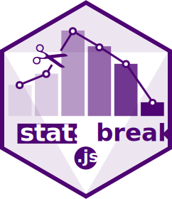

**statsbreaks** is a javascript package whose objective is to split (to classify/to discretize) a quantitative dataset into a (k) number of classes or thematic categories.
The general aim is to create a choropleth map, for example with [bertin.js](https://observablehq.com/@neocartocnrs/bertin-js-chropoleth?collection=@neocartocnrs/bertin).




## 1. Installation

#### <ins>In browser</ins>

Last version

```html
<script src="https://cdn.jsdelivr.net/npm/statsbreaks@1" charset="utf-8"></script>
```

Pinned version

```html
<script src="https://cdn.jsdelivr.net/npm/statsbreaks@1" charset="utf-8"></script>
```

#### <ins>In Observable</ins>

Last version

~~~js
stat = require("statsbreaks")
~~~

Pinned version

~~~js
stat = require("statsbreaks@1")
~~~

## 2. Methods

The **`breaks()`** function allows to compute breaks according to several discretization methods. [Source](https://github.com/neocarto/statsbreaks/blob/main/src/breaks.js)

Parameters

- <b>`method`</b>: method of discretization. "quantile", "q6", "equal", "msd", "jenks", "geometric", "headtail" or "pretty" (default: "quantile")
- <b>`nb`</b>: number of classes (default: "5")
- <b>`precision`</b>: rounding of values. 2 transform 35667.877876 to 35667.87 -2 transform 35667.877876 to 35600. (default: 2)
- <b>`minmax`</b>: a boolean to keep or remove min and max values (default: true)
- <b>`middle`</b>: a boolean to have the average as a class center. Available with "msd" method only (default: false)
- <b>`k`</b>: Number of standard deviations taken into account. Available with "msd" method only (default: 1)

#### `quantile` 

- The **`quantile`** method (or equal numbers) constructs classes in which there are the same number of statistical units. When there are 4 classes, the term used is quartiles (one quarter of the total number in each classes), when there are 10 classes, they are known as deciles, and for 100 classes, they will be centiles. This classification method can be used with any type of distribution, and it enables the comparison of maps one to another.

~~~js
breaks(data, {method: "quantile", nb: 5, precision: 2 })
~~~

#### `q6`

The **`q6`** method is a variation of the quantile method with 6 classes and isolation of extremes classes (5%).

~~~js
breaks(data, {method: "q6", nb: 5, precision: 2 })
~~~

#### `jenks`

The **`Jenks`** method is an automatic classification method based on the principle of resemblance or non-resemblance among values. The method works via iterations. It groups values that most resemble one another and those that least resemble one another. In statistical terms, the method aims to minimize intra-class variance and to maximize inter-class variance.

~~~js
breaks(data, {method: "jenks", nb: 5, precision: 2 })
~~~

#### `equal`

The **`equal`** method is constructed by dividing up the extent of a statistical series (max - min) into the desired number of classes. This method is used even or symmetrical distributions. It should be avoided for strongly skewed distributions. This method does not enable the comparisons of several maps.

~~~js
breaks(data, {method: "equal", nb: 5, precision: 2 })
~~~

#### `geometric`

The **`geometric`** progression is suited to highly skewed distributions. It consists in constructing classes whose extent increases with each class, which enables close follow-up of the statistical series.

~~~js
breaks(data, {method: "geometric", nb: 5, precision: 2 })
~~~

#### `arithmetic`

The **`arithmetic`** progression is suited to right-skewed distributions (i.e. with many low values and few high ones). It consists in constructing classes whose amplitude increases in an arithmetical progression.

~~~js
breaks(data, {method: "arithmetic", nb: 5, precision: 2 })
~~~


#### `msd`

The *mean standard deviation* method (**`msd`**) is based on significant values (mean and standard deviation). This type of classification is ideal for symmetrical (normal, Gaussian) distributions and should be solely in the instance. When the distribution is skewed, it is preferable tu use another method.

~~~js
breaks(data, {method: "msd", k: 0.5, middle: true, precision: 2 })
~~~

#### `headtail`

The **`headtail `** method is a data classification method in which the number of classes and the class intervals are both naturally determined by the very property of the heavy-tailed distributions of the data. It works with up to 7 classes.

~~~js
breaks(data, {method: "headtail", nb: 5, precision: 2 })
~~~

#### `pretty`

The **`pretty`**  method generates breaks that are equally spaced round values which cover the range of values in the input array. The breaks are chosen so that they are 1, 2, or 5 times a power of 10.

~~~js
breaks(data, {method: "pretty", nb: 5, precision: 2 })
~~~

## 3. Object-oriented API

For each classification method, you can also use an object-oriented API.

Classes available are: `JenksClassifier`, `EqualClassifier`, `GeometricProgressionClassifier`, `HeadTailClassifier`, `MsdClassifier`, `PrettyBreaksClassifier`, `QuantileClassifier`, `Q6Classifier`, `ArithmeticProgressionClassifier` and `CustomBreaksClassifier`.
  
For example

~~~js
series = new discr.JenksClassifier(data, 2)
~~~

where data is an array of values and 2 the precision.

**`classify`** computes the break values for the given number of classes and returns it.

~~~js
series.classify(7)
~~~

**`countByClass`** count how many individuals in each class

~~~js
series.countByClass()
~~~

**`getClass`** get the class index for a specific individual. For example, the value 30000 is in the index 2 class, i.e. the third class.

~~~js
series.getClass(30000)
~~~

You can use also **`min`**, **`max`**, **`mean`**, **`median`**, **`stddev`** and **`population`**.


~~~js
series.min()
~~~

~~~js
series.max()
~~~

~~~js
series.population()
~~~

~~~js
series.mean()
~~~

~~~js
series.median()
~~~

~~~js
series.stddev()
~~~


## 4. Live demo

Live demo available here: https://observablehq.com/@neocartocnrs/hello-statsbreaks